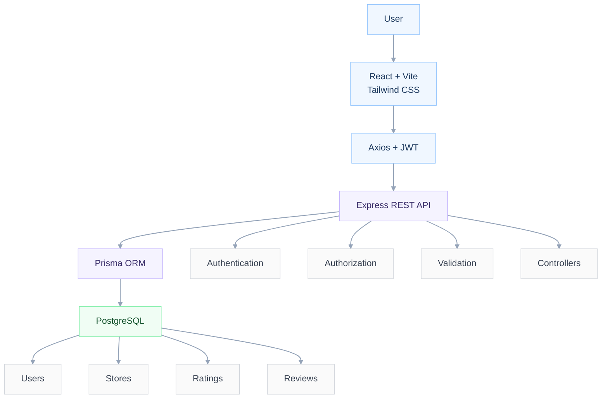

# ⭐ StoreRate — Store Rating Platform

A full-stack web application where users can discover registered stores and submit **1–5 star ratings with optional written feedback**.

StoreRate supports a single login system with three role-based experiences:

- 🛡️ **System Administrator**
- 👤 **Normal User**
- 🏪 **Store Owner**

Each role has its own dashboard, permissions, and workflows.

---

### 🌐 Live Demo

| Service | Link |
|---|---|
| 🌎 Frontend | `https://store-rate-fullstack-intern-challen.vercel.app` |
| ⚙️ Backend API | `https://storerate-fullstack-intern-challenge.onrender.com` |
| 📦 Repository | `https://github.com/sayaligurav7789/StoreRate-fullstack-intern-challenge` |

> The backend may take a few seconds to respond after a period of inactivity on free hosting.
---

### 🔑 Demo Accounts

| Role | Email | Password |
|---|---|---|
| 🛡️ System Administrator | `admin@storerating.com` | `Admin@1234` |
| 🏪 Store Owner | `owner1@storerating.com` | `Owner@1234` |
| 👤 Normal User | `sayali123@gmail.com` | `Sayali@123` |

> These credentials are provided for demonstration/testing purposes.

---

### 🧰 Tech Stack

<p>
  
  
  
  
</p>
<p>
  
  
  
  
</p>

| Layer | Technology | Icon |
|---|---|:---:|
| Frontend | React + Vite |  |
| Styling | Tailwind CSS |  |
| API Client | Axios | 🔗 |
| Backend | Node.js |  |
| API Framework | Express.js |  |
| Database | PostgreSQL |  |
| ORM | Prisma |  |
| Authentication | JWT + bcrypt | 🔐 |
| Validation | express-validator | ✅ |
| Testing | Jest + Supertest |  |
| Version Control | Git + GitHub |  |
| Deployment | Vercel + Render | ☁️ |

---

### ✨ Key Features

-  JWT-based authentication
-  bcrypt password hashing
-  Three role-based user types
-  System Administrator dashboard
-  Normal User store browsing
-  Store Owner analytics dashboard
-  1–5 star ratings
-  Optional written feedback/comments
-  Update previously submitted ratings
-  Store and user search
-  Filtering by relevant fields
-  Ascending/descending sorting
-  Dashboard statistics
-  Store Owner customer/rating information
-  Client-side validation
-  Server-side validation
-  Jest + Supertest backend tests
-  PostgreSQL + Prisma ORM
-  Responsive React interface
-  Production deployment with Vercel and Render

---

### 📁 Folder Structure
```
store-rating-app/
├── backend/
│   ├── prisma/
│   │   ├── schema.prisma      # User / Store / Rating models, Role enum
│   │   └── seed.js            # Sample admin, owners, users, stores, ratings
│   ├── src/
│   │   ├── controllers/       # authController, adminController, storeController, ratingController
│   │   ├── middleware/        # auth (JWT + role guard), validate, errorHandler
│   │   ├── routes/            # authRoutes, adminRoutes, storeRoutes, ratingRoutes
│   │   ├── utils/             # prismaClient singleton, express-validator rule builders
│   │   ├── app.js             # Express app (middleware + routes)
│   │   └── server.js          # Entry point
│   ├── tests/app.test.js      # Jest + Supertest tests
│   ├── .env.example
│   ├── .gitignore
│   └── package.json
├── frontend/
│   ├── src/
│   │   ├── api/axios.js       # Axios instance with JWT interceptor
│   │   ├── context/AuthContext.jsx
│   │   ├── components/        # Navbar, ProtectedRoute, StarRating, DataTable, Modal, etc.
│   │   ├── pages/              # Login, Signup, ChangePassword, AdminDashboard, AdminUsers,
│   │   │                       # AdminStores, UserStores, StoreOwnerDashboard, NotFound
│   │   ├── utils/validation.js
│   │   ├── App.jsx             # Routes
│   │   └── main.jsx
│   ├── index.html
│   ├── tailwind.config.js
│   ├── postcss.config.js
│   ├── vite.config.js
│   ├── .env.example
│   ├── .gitignore
│   └── package.json
└── README.md   ← you are here
```
---

### 🏗️ Application Architecture

---

### ✅ Prerequisites

| Requirement | Version |
|---|---|
|  Node.js | 18+ |
|  npm | latest |
|  PostgreSQL | 13+ (local or hosted) |
|  Git | any recent version |

---

### 🗄️ Database Schema

StoreRate uses **PostgreSQL** with **Prisma ORM** to manage users, stores, ratings, and relationships.

| Table | Key Columns | Description |
|---|---|---|
| `users` | `id`, `name`, `email`, `password`, `address`, `role` | Stores authentication details and user roles |
| `stores` | `id`, `name`, `email`, `address`, `ownerId` | Stores registered stores and their optional owners |
| `ratings` | `id`, `value`, `comment`, `userId`, `storeId` | Stores ratings and optional written feedback |

### 🔗 Database Relationships

- A **Store Owner** can own one store.
- A **Store** can have multiple ratings.
- A **User** can submit multiple ratings.
- A user can submit **only one rating per store**.
- Existing ratings can be updated.
- Deleting a user cascades to their ratings.
- Deleting a store cascades to its ratings.

### ⭐ Rating Constraints

| Field | Rule |
|---|---|
| `value` | Integer from 1–5 |
| `comment` | Optional, maximum 500 characters |
| `userId + storeId` | Unique combination |
| `storeId` | Indexed |
| `userId` | Indexed |
| `role` | Indexed |

> The `userId + storeId` unique constraint ensures that each user can rate a particular store only once while still allowing them to update their existing rating.
---
### 🔐 Authentication Flow

1. User logs in with email and password.
2. Backend validates the credentials.
3. Password is verified using bcrypt.
4. Server generates a JWT.
5. Frontend stores the authenticated session.
6. Axios attaches the JWT to protected API requests.
7. Backend verifies the token and checks the user's role.
---

### ⚙️ Backend Setup

```bash
cd backend
npm install
cp .env.example .env
npx prisma generate
npx prisma migrate dev --name init
npm run seed
npm run dev
```
---

### 💻 Frontend Setup
```bash
cd frontend
npm install
cp .env.example .env
npm run dev
```
---
### 🧪 Backend Tests

```bash
cd backend
npm test
```
- Runs Jest + Supertest against the Express app (health check + validation-layer tests
that don't require a live database connection).
---
### 📋 Feature Checklist

### 🛡️ System Administrator

- [x] Add new stores
- [x] Add normal users
- [x] Add administrator users
- [x] Dashboard statistics
- [x] Total registered users
- [x] Total registered stores
- [x] Total ratings
- [x] View stores
- [x] Search and filter stores
- [x] Sort stores
- [x] View users
- [x] Search and filter users
- [x] Sort users
- [x] View user details
- [x] View Store Owner rating information
- [x] Logout

---

### 👤 Normal User

- [x] Signup
- [x] Single login endpoint for all roles
- [x] Update password
- [x] View registered stores
- [x] Search stores by name
- [x] Search stores by address
- [x] View overall store rating
- [x] View personal rating
- [x] Submit 1–5 star rating
- [x] Modify existing rating
- [x] Add optional written feedback
- [x] Logout

---

### 🏪 Store Owner

- [x] Login
- [x] Update password
- [x] Store Owner dashboard
- [x] View users who rated the store
- [x] View average rating
- [x] View customer feedback
- [x] Logout
---

### ✅ Validation
*(enforced both client-side for UX and server-side via express-validator — server is authoritative)*

| Field | Rule |
|---|---|
| Name | 20–60 characters |
| Address | Max 400 characters |
| Password | 8–16 characters, ≥1 uppercase, ≥1 special character |
| Email | Standard format validation |

### 🔩 Other
- [x] All listing tables support ascending/descending sort on key fields
- [x] Passwords hashed with bcrypt; auth via JWT bearer tokens
- [x] Role-based route guards on both API (`authorize()` middleware) and frontend (`ProtectedRoute`)
---

## 🚀 Pushing to GitHub

From the **project root** (the folder containing `backend/` and `frontend/`):

```bash
git init
git add .
git commit -m "Initial commit: full-stack store rating platform"
git branch -M main
git remote add origin https://github.com/<your-username>/<your-repo-name>.git
git push -u origin main
```

> `.env` files are excluded via `.gitignore` in both `backend/` and `frontend/` — only
> `.env.example` is committed, so no secrets end up in the repo.

---

## 👩‍💻 Author
### **Sayali Gurav 🌱**


---

🔗 **Connect with me**

[](https://github.com/sayaligurav7789)
[](https://linkedin.com/in/sayali-gurav-9a3a302a5)
[](https://sayali-gurav7789-portfolio.vercel.app)
[](https://leetcode.com/sayaliGurav)
[](mailto:sayligurab7789@gmail.com)

---

